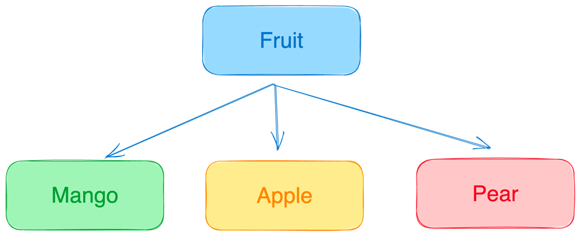

[](https://classroom.github.com/online_ide?assignment_repo_id=14053098&assignment_repo_type=AssignmentRepo)

# Mango Tree

Mango Tree

Learning Competencies
● Menggunakan JavaScript Coding Conventions
● Pemodelan sistem dengan Object Oriented Programming
● Memahami pembuatan dan cara penggunaan dari instance method
● Memahami karakteristik OOP di JavaScript
● Memahami cara penggunaan multiple file (export)

Summary
Mari membuat aplikasi mainan emulator pohon mangga. Dimana, kita bisa menanam pohon, kemudian menunggu hingga berbuah sampai memanen.

### Release 0: Create `MangoTree`

Buatlah sebuah class yang bernama MangoTree dan memiliki properti sebagai berikut:

-   age (static value : 0)
-   height (static value : 0)
-   healthStatus (default : true)
    Menentukan hidup atau matinya pohon mangga. Pada awal penanaman, pohon mangga pasti masih hidup. (dinamis).
-   matureAge (default : 5) => Umur dimana pohon mangga mulai berbuah (dinamis).
-   deathAge (private) => Umur dimana pohon mangga menemui ajalnya.
-   fruits (value : [ ] Array)
    Kumpulan buah yang dihasilkan oleh pohon mangga. Pada awal penanaman, pohon mangga belum mempunyai buah. Dan baru akan terisi dengan beberapa buah mangga ketika mencapai matureAge. (Detail proses berbuah akan ada di Release 1)
-   harvested (value: {good: 0, bad: 0, count: 0})
    Catatan hasil panen buah mangga, berdasar total buah keseluruhan setiap kali panen serta total buah berdasar kualitas.

Untuk setiap private property jangan lupa untuk membuat accessor (getter) dan mutator (setter).

Berikut adalah contoh apabila kalian sudah membuat properti dengan cara yang tepat.


Note: Pada hasil console.log, private property tidak akan terlihat di terminal. Sehingga pada object instance mango tree property deathAge tidak terlihat.

### Release 1: Create `grow` method

Instance method grow() akan menumbuhkan pohon mangga per 1 tahun. Hal yang terjadi ketika pohon tumbuh adalah:

-   Umur pohon bertambah
-   Pohon bertambah tinggi, pertambahan tinggi harus random dari 1-6. Gunakanlah Math.random().
-   Jika umurnya sudah mencapai deathAge maka terjadi perubahan pada healthStatus menjadi false
    Jika sudah selesai membuat function grow, silahkan coba bayangkan, apabila pohon sudah mati dan kita menjalankan function grow apakah umur dan tinggi dari pohon masih bertambah atau tidak?. Seharusnya tidak. Maka pastikan itu tidak terjadi pada function yang dibuat.

    Buatlah validasi : pada method grow bahwa pohon hanya dapat tumbuh ketika pohon masih sehat dan belum mati.

    

### Release 2: Create class `Mango`

Sebelum lanjut mengerjakan method produceFruits(), silakan buat dulu class Mango yang merupakan buah dari `MangoTree`.
Property yang dimiliki oleh class `Mango`, adalah:

-   quality (value: ’’ String): Merupakan kualitas dari buah mango. Isinya random antara ‘good’ atau ‘bad’.

Buatlah logic untuk me-’random’ kualitas mango dengan menggunakan Math.random untuk menghasilkan angka 0 dan bilangan bulat positif sampai 3 (0 - 3).
Jika hasil random adalah 0 maka quality = ‘bad’, Jika hasil random adalah 1/2/3 maka quality = ‘good’

Berikut contoh apabila kalian telah membuat class Mango dengan benar.


Pertanyaan yang perlu dijawab ketika kalian sudah selesai:
● Apakah masih ada logic di constructor?
Apabila ada, kalian harus membuat instance method baru dalam class Mango dan pindahkan logicnya disana ya! Sehingga didalam constructor hanya memanggil instance method tersebut.
Jika sudah tepat, mari kita lanjut dengan pembuatan method produceFruits.

### Release 3: Create `produceFruits` Method

Method produceFruits() akan membuat pohon mangga berbuah dan menghasilkan buah Mangga saat umurnya sudah mencapai `matureAge`. Saat method ini dijalankan, property `fruits` akan memiliki value beberapa object (instance) dari class Mango, yang jumlahnya ditentukan secara random dari 5-20. Perlu diingat pohon tidak akan berbuah jika kondisinya tidak terpenuhi.
Buatlah validasi : pada method ini bahwa pohon hanya dapat berbuah ketika pohon masih sehat (belum mati) dan sudah mencapai umur yang ditentukan untuk berbuah.

Berikut contoh apabila kalian telah membuat method produceFruits dengan benar.


Menurut kalian jenis relasi apakah yang dimiliki oleh class MangoTree dengan class Mango ? Jawablah pertanyaan tersebut pada driver code index.js (### Release 3) setelah lecture W1D3 AM !
Setelah pohon menghasilkan buah mangga, maka mari memanen!

### Release 4: Create `harvest` method, getter `harvestReport`, & `resetHarvest` method

1. Instance Method harvest() digunakan untuk memetik buah dari pohon.
   Dalam setiap panen, kalian harus melakukan pencatatan hasil panen pada property harvested. Yang berisi property:

-   `count`: Total buah keseluruhan yang dipanen
-   `good`: Total buah yang memiliki kualitas `good`
-   `bad`: Total buah yang memiliki kualitas `bad`

2. Buatlah sebuah getter bernama `harvestReport` yang berfungsi untuk mengconvert / menampilkan report dari property `harvested` dari object menjadi string
   {good: 10, bad: 5, count: 15} => “15 (10 good, 5 bad)”
3. Instance Method resetHarvest() digunakan untuk mengosongkan kembali property `fruits` & property `harvested` setelah pohon berhasil dipanen.
   Ingat, setiap kali panen, buah di pohon akan habis.


### Release 5: Run the driver code

    Apabila kalian yakin step sebelumnya telah dijalankan dengan tepat. Maka bisa kalian test dengan cara berikut:
    console.log(`The tree is alive! :smile:`)

let mangoTree = new MangoTree(1, 10) // menanam pohon

do {
mangoTree.grow();
mangoTree.produceFruits();
mangoTree.harvest();
console.log(`[Year ${mangoTree.age} Report] Height = ${mangoTree.height} m | Fruits harvested = ${mangoTree.harvestReport}`)
mangoTree.resetHarvest();
} while (mangoTree.healthStatus != false)

console.log(`The tree has met its end. :sad:`)

Contoh output yang diharapkan:

```
The tree is alive! :smile:
[Year 1 Report] Height = 4 m | Fruits harvested = 1 (1 good, 0 bad)
[Year 2 Report] Height = 10 m | Fruits harvested = 4 (4 good, 0 bad)
[Year 3 Report] Height = 16 m | Fruits harvested = 8 (5 good, 3 bad)
[Year 4 Report] Height = 21 m | Fruits harvested = 4 (3 good, 1 bad)
[Year 5 Report] Height = 24 m | Fruits harvested = 1 (1 good, 0 bad)
[Year 6 Report] Height = 29 m | Fruits harvested = 2 (1 good, 1 bad)
[Year 7 Report] Height = 33 m | Fruits harvested = 9 (8 good, 1 bad)
[Year 8 Report] Height = 39 m | Fruits harvested = 13 (11 good, 2 bad)
[Year 9 Report] Height = 44 m | Fruits harvested = 10 (9 good, 1 bad)
[Year 10 Report] Height = 46 m | Fruits harvested = 0 (0 good, 0 bad)
The tree has met its end. :sad:
```

Perhatikan pada output harvested, buatlah getter untuk menampilkan harvested sesuai dengan format.

### Release 6: The `AppleTree` and `Apple` Classes

Mari kita mulai dengan mendefinisikan class AppleTree dan Apple!
Class `AppleTree` dan `Apple` memiliki property serta method yang sama dengan class `MangoTree` dan `Mango`. Meskipun dalam `AppleTree` pasti ada perbedaan di alur kehidupannya seperti:

-   Kapan pohon apel mulai berbuah
-   Kapan pohon apel mati
-   Dan lain-lain..

Membuat class `Apple` dan `AppleTree`, kamu bisa meng-copy code dari class `Mango` dan `MangoTree` sebagai template.

Jika kesulitan, coba cari bantuan dan bertanya ya!

### Release 7: Inheritance - The Parent `FruitTree`, `Fruit` Classes

Sekarang kita mempunyai dua jenis pohon dengan jenis buahnya yang berbeda pula. Baik class `MangoTree` dan `AppleTree`, atau class `Mango` dan `Apple memiliki code yang hampir mirip. Beberapa bagian bahkan sama persis. 
Salah satu cara untuk menghindari pengulangan code seperti ini adalah dengan menerapkan inheritance. Copy-lah kode dengan bagian yang sama ke kelas parent atau induk dan namakan kelas parent tersebut sebagai `FruitTree`dan`Fruit`. Buatlah class `FruitTree`dan`Fruit`dalam file`fruitTree.js`

Sehingga, class `MangoTree` dan `AppleTree` menjadi sebagai berikut:


FruitTree merupakan parent dari MangoTree dan AppleTree.

Dan class `Mango` dan `Apple` menjadi sebagai berikut:

Fruit merupakan parent dari Mango dan Apple.

Pertanyaan yang perlu dijawab ketika kalian sudah selesai:

-   Apakah kode kalian masih ada yang berulang? Karena tujuan inheritance dapat membuat kode kalian tidak berulang.
-   Apakah beberapa isi properti dari class `MangoTree`, `AppleTree`, `FruitTree` sudah dinamis? Pikirkan dengan matang property yang dapat menjadi dinamis dalam suatu pohon ketika pertama kali ditanam. (Value property yang dinamis bisa kalian masukkan sebagai parameter constructor)
    Ketentuan :
-   MangoTree
    -   matureAge selalu bernilai 5 tahun dan tidak dapat berubah
    -   deathAge default 10 tahun, dapat berubah.
-   AppleTree
    -   matureAge selalu bernilai 2 tahun dan tidak dapat berubah
    -   deathAge default 20 tahun, dapat berubah.

### Release 8: The `PearTree` and `Pear` Classes

Kita sudah memiliki class `FruitTree` dan `Fruit`, sekarang saatnya membuat class baru `PearTree` yang menghasilkan buah `Pear`.
Ketentuan :

-   PearTree
    -   matureAge selalu bernilai 3 tahun dan tidak dapat berubah
    -   deathAge default 15 tahun, dapat berubah.
    -   thorny (value: true) property tambahan yang hanya dimiliki oleh PearTree

Tree:

Fruit:


### Release 9: Polymorphism

Pada method produceFruits MangoTree Release 1, kalian telah diminta untuk menghasilkan buah mangga dengan jumlah random.
Sekarang, dengan nama method yang sama, gunakan polymorphism overriding untuk mengaplikasikan ke class `MangoTree`, `AppleTree` dan `PearTree`.
Pada release ini kita akan mengubah 2 hal pada pohon-pohon ini:

1. Method grow sebelumnya adalah menambah tinggi secara random dari 1-6. Sekarang kita akan sesuaikan sesuai dengan pohon-pohonnya.
   a. MangoTree ketika grow tetap bertambah tinggi dari 1-6
   b. AppleTree ketika grow maka akan bertambah tinggi dari 0.1-0.9
   c. PearTree ketika grow maka akan bertambah tinggi dari 3-8
2. Method produceFruits sebelumnya pohon akan berbuah secara random dari 5-20. Sekarang khusus untuk `PearTree` berbuah secara konstan yaitu 15.

Hint:

-   Hasil akhir jika menggunakan polymorphism overriding ini memungkinkan ada perbedaan logic walau mempunyai nama method yang sama dalam setiap parent class maupun child class.
-   Pastikan buah yang dihasilkan sesuai dengan pohonnya masing-masing.

1. Kerjakan Release 0 - 5 pada file index.js
2. Kerjakan Release 6 pada file `appleTree.js`
3. Kerjakan Release 7 - 9 pada file `fruitTree.js` `mangoTree.js`, `appleTree.js` & `pearTree.js`
