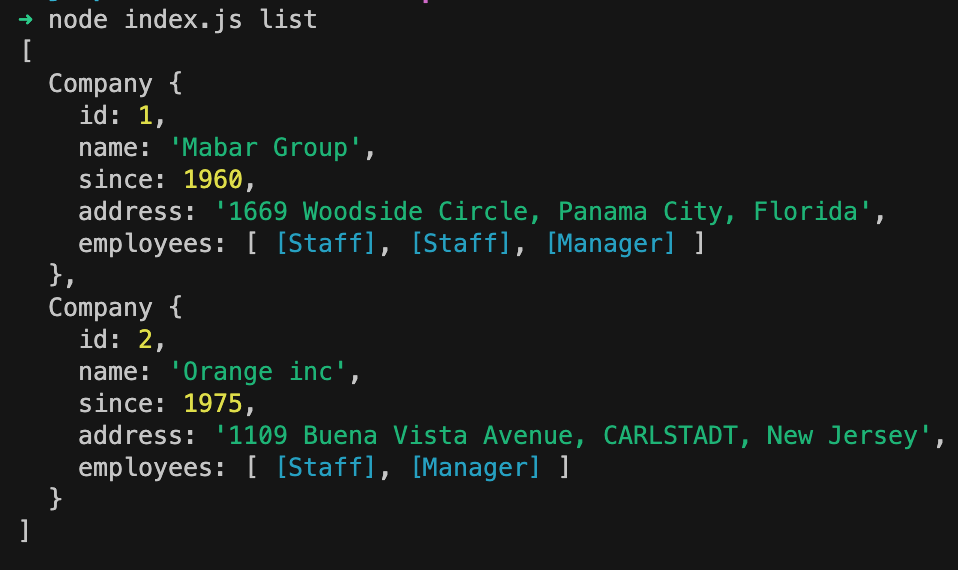

[](https://classroom.github.com/online_ide?assignment_repo_id=14161686&assignment_repo_type=AssignmentRepo)
# Hacktiv8 Office

> _⏰_ Time Estimation 120 minutes

## Summary
Kalian diminta untuk membuat sebuah aplikasi bernama `Hacktiv Company` yang akan membantu para `Company` mendata `Employee`. Buatlah dengan MVC Async (fs.readFile dan fs.writeFile)

***dilarang mengubah format key dari data.json***

## RELEASE 0

Buatlah class `Company` yang memiliki property :

| Property      | Description                                               |
| ------------- | --------------------------------------------------------- |
| id            | id dari `Company`                                         |
| name          | nama dari `Company`                                       |
| since         | tahun berdiri dari `Company`                              |
| address       | alamat dari `Company`                                     |
| employees     | kumpulan instance dari karyawan                           |

Terdapat `Employee` di perusahaan tersebut, dimana `Employee` memiliki property:

| Property      | Description                                               |
| ------------- | --------------------------------------------------------- |
| name          | nama dari `Employee`                                      |
| ktp           | ktp dari `Employee`                                       |
| joined_year   | tahun bergabungnya `Employee` ke `Company`                |
| position      | posisi dari `Employee`                                    |
| salary        | (private) gaji dari `Employee`                            |

ada 2 position `Employee` yang dijadikan class masing-masing yaitu:

1. `Staff`
   - position: "Staff"
2. `Manager`
   - position: "Manager"

Buatlah berbagai class yang diperlukan dari data di atas !

> gunakan factory method untuk membuat instance

## RELEASE 1
Buatlah fitur untuk menampilkan seluruh `Company` bersamaan dengan seluruh `Employee`nya
  - Example :
    ```bash
     $ node index.js list
    ```
  - Output :

    

## RELEASE 2
Teman kamu kesulitan dalam menghitung masa kerja dari setiap karyawannya. kamu diminta untuk menambahkan **1 getter atau instance method** yang menampilkan lama bekerja dari setiap karyawan.

  - kamu dapat menggunakan fitur di javascript untuk mendapatkan tahun sekarang
  _(hanya menghitung tahun kerja. Tidak memperdulikan bulan dan tanggal)_

- Rules :
  - HARUS menggunakan **Getter / Instance Method** untuk mengimplementasikan fitur ini.
  - Tidak boleh menambahkan property baru pada instance (output dari Model)
  - Buatlah logic pada View untuk mengatur tampilan sesuai pada table.
  
      ```bash
        $ node index.js listEmployee 1
      ```
    Expected output :

      ```bash
      ====================
      == List Employee ===
      ====================
      Company Name: Mabar Group
      Since: 1960
      Address: 1669 Woodside Circle, Panama City, Florida

      | (index) | name     | ktp          | joined_year | position  | lengthOfWork |
      |---------|----------|--------------|-------------|-----------|--------------|
      | 0       | 'Denuj'  | 3748592745   | 2021        | 'Staff'   | 2            |
      | 1       | 'Rina'   | 4563456787   | 2022        | 'Staff'   | 1            |
      | 2       | 'Sakura' | 9346783455   | 2017        | 'Manager' | 6            |
      ```

## RELEASE 3

1. buatlah instance method dengan nama applySalary

- karyawan dengan masa bekerja mulai dari 1 tahun ke atas akan mendapatkan kenaikan gaji
- besar kenaikan gaji berdasarkan dari level karyawan
  - Default kenaikan gaji pada `Employee` adalah 10% dari gaji sebelumnya
  - `Staff` tetap naik 10% dari gaji sebelumnya
  - `Manager` naik 15% dari gaji sebelumnya

- Rules :
  - HARUS menggunakan Konsep **Polymorphism** untuk mengimplementasikan fitur ini.
  - Tidak boleh menambahkan property baru pada instance (output dari Model)
  - Buatlah logic pada View untuk mengatur tampilan sesuai pada table.


  - Example :
    ```bash
    $ node index.js listEmployee 1
    ```

  - Expected output :
    ```bash
    ====================
    == List Employee ===
    ====================
    Company Name: Mabar Group
    Since: 1960
    Address: 1669 Woodside Circle, Panama City, Florida

    | (index) | name     | ktp          | joined_year | position  | lengthOfWork | salaryEstimate |
    |---------|----------|--------------|-------------|-----------|--------------|----------------|
    | 0       | 'Denuj'  | 3748592745   | 2021        | 'Staff'   | 2            | 14300000       |
    | 1       | 'Rina'   | 4563456787   | 2022        | 'Staff'   | 1            | 13200000       |
    | 2       | 'Sakura' | 9346783455   | 2017        | 'Manager' | 6            | 57500000       |
    | 3       | 'Tarjo'  | 123999345001 | 2023        | 'Staff'   | 0            | 10000000       |
    ```

## RELEASE 4
> `FORMAT DATA PADA "data.json" TIDAK BOLEH DIUBAH`

> Perlu diingat bahwa private property tidak dapat dibaca oleh JSON stringify sehingga kamu perlu melakukan adjusment
1. Buatlah fitur untuk menambahkan data `Employee` kepada `Company` tertentu sesuai id
    ```bash
    $ node index.js add <id_company> <name> <ktp> <joined_year> <position> <salary>
    ```
  - Example :
    ```bash
     $ node index.js add 1 Tarjo 123999345001 2021 Staff 10000000
    ```
  - Output :
    ```bash
    =============
    == SUCCESS ==
    =============
    Success add Tarjo as employee
    ```
2. Buatlah validasi jika menambahakan employee baru dengan id company yang tidak ada

    Contoh pesan error sebagai berikut:
  - Example :
    ```bash
     $ node index.js add 10 Tarjo 123999345001 2021 Staff 10000000
    ```
  - Output :
    ```bash
    ===========
    == Error ==
    ===========
    Company not found
    ```

