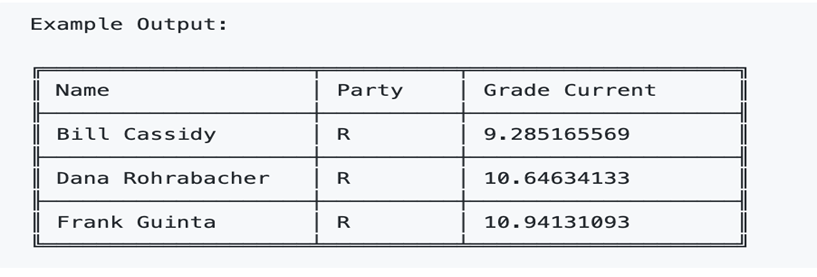

Built In Function

Learning Competencies

-   Mampu memahami penggunaan built in function di javascript
-   Mampu menggunakan callback pada built in function di javascript

Summary
Didalam Javascript Seperti yang sudah kalian ketahui memiliki banyak penggunaan built in function yang memudahkan kita dalam menulis kode. Dari beberapa built in function tersebut ada beberapa yang menggunakan callback function dan memiliki ciri khas tertentu. Cobalah pahami dan ketahui kapan kamu harus menggunakannya.

## Release 0: Built in Function in array manipulation!

Diberikan beberapa data dalam array seperti berikut

```js
const countries = [
    "Estonia",
    "Finland",
    "Sweden",
    "Denmark",
    "Norway",
    "IceLand",
];
const names = ["Asabeneh", "Mathias", "Elias", "Brook"];
const numbers = [1, 2, 3, 4, 5, 6, 7, 8, 9, 10];
```

1. Gunakan forEach untuk console.log setiap negara, nama, nomor dalam array.
2. Gunakan map untuk membuat array baru dengan mengubah setiap negara menjadi huruf besar di array negara;
3. Gunakan map untuk membuat array baru dengan mengubah setiap angka menjadi kuadrat dalam array angka
4. Gunakan map untuk mengubah setiap nama menjadi huruf besar dalam array nama
5. Gunakan filter untuk menyaring negara yang mengandung ’land’.
6. Gunakan filter untuk menyaring negara yang memiliki enam karakter.
7. Gunakan filter untuk memfilter negara yang berisi enam huruf atau lebih banyak lagi dalam array negara.
8. Gunakan filter untuk menyaring negara yang dimulai dengan 'E';
9. Rantai (chaining) dua atau lebih array iterator (mis. arr.map(callback).filter(callback).reduce(callback)) dan tampilkan hasilnya dalam console (pilih salah satu array)
10. Deklarasikan fungsi yang disebut getStringLists yang mengambil array sebagai parameter dan kemudian mengembalikan array hanya dengan item string.
11. Gunakan reduce untuk menjumlahkan semua angka dalam array numbers.
12. Gunakan reduce untuk menggabungkan semua negara dalam array countries dan untuk menghasilkan kalimat ini: Estonia, Finlandia, Swedia, Denmark, Norwegia, dan IceLand adalah negara-negara Eropa utara
13. Jelaskan perbedaan antara some dan every
14. Gunakan some untuk memeriksa apakah panjang beberapa nama dalam array names lebih besar dari tujuh dalam array nama
15. Gunakan every untuk memeriksa apakah semua negara dalam array countries mengandung kata ‘land’
16. Jelaskan perbedaan antara find dan findIndex.
17. Gunakan find untuk menemukan negara pertama yang hanya berisi enam huruf dalam array countries
18. Gunakan findIndex untuk menemukan posisi negara pertama yang hanya berisi enam huruf dalam array countries
19. Gunakan findIndex untuk menemukan posisi Norwegia jika tidak ada dalam array countries Anda akan mendapatkan -1.
20. Gunakan findIndex untuk menemukan posisi Rusia jika tidak ada dalam array countries Anda akan mendapatkan -1.

## Release 1: More and More...

Diberikan data list of country pada countries.js dalam array seperti berikut

```js
const countries = [
'Afghanistan',
'Albania',
...
...
'Zambia',
'Zimbabwe',
];
```

1. Deklarasikan fungsi getFirstTenCountries dan kembalikan array sepuluh negara pertama pada data file countries.js
2. Deklarasikan fungsi getLastTenCountries yang mengembalikan sepuluh negara terakhir pada data file countries.js

Diberikan data list of country pada countries-object.js dalam array dan kodinglah pada countries-detail.js seperti berikut

```js
// file countries-object.js
const countries = [
{
name: 'Afghanistan',
capital: 'Kabul',
languages: ['Pashto', 'Uzbek', 'Turkmen'],
population: 27657145,
flag: 'https://restcountries.eu/data/afg.svg',
currency: 'Afghan afghani',
},
{
name: 'Åland Islands',
capital: 'Mariehamn',
languages: ['Swedish'],
population: 28875,
flag: 'https://restcountries.eu/data/ala.svg',
currency: 'Euro',
},
...
]
module.exports = countries
```

3. Gunakan informasi negara, di folder data countries-obj.js. Urutkan negara berdasarkan nama, berdasarkan kapital, berdasarkan populasi
4. Urutkan sepuluh bahasa yang paling banyak digunakan dan jumlahnya.
5. Urutkan sepuluh negara terpadat penduduk populasinya.

NOTE
Gunakanlah library cli-table / `console.table()` jika kamu ingin bereksperimen membuat hasil query kamu berada dalam tabel.


