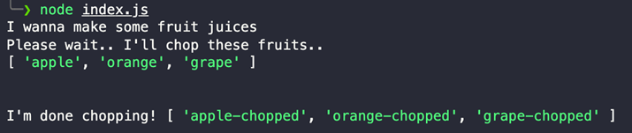
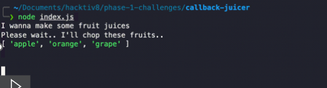
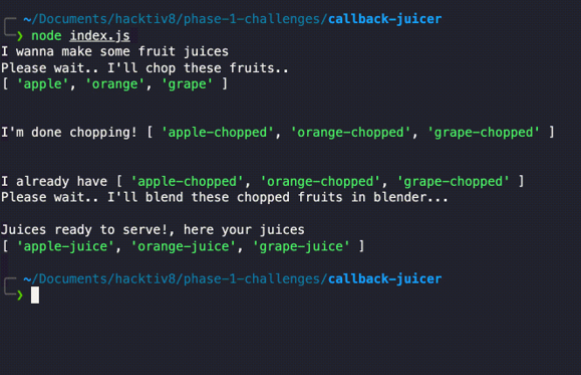

Callback Juicer
Learning Competencies
● Memahami dan dapat membuat callback
● Mampu membedakan callback sync dan async
● Mampu membuat nested callback

Summary
Kamu diminta untuk membuat beberapa jus buah, yang tentunya memerlukan waktu untuk membuatnya. Dua langkah utama yang harus dilakukan:

1. Memotong buah
2. Memblender buah

Siapkan function utama bernama startJuicing(). Proses pemotongan buah dan blender akan terjadi didalam function tersebut.
Release 0: Memotong Buah - Fruit Chop

1. Function fruitChop() menerima 2 parameter, yaitu array nama buah dan callback. Function ini akan mengembalikan array nama buah yang sudah di chopped.

```js
// Driver Code
"use strict";

function fruitChop(fruits, cb) {
    console.log("Please wait.. I'll chop these fruits..");
    console.log(fruits);
    console.log("\n");

    // process chopping disini

    // cend in herb("what will you se?")
}

// MAIN FUNCTION
function startJuicing(result) {
    console.log("I wanna make some fruit juices");
    const fruits = ["apple", "orange", "grape"];

    // Panggil/invoke function fruitChop
    fruitChop(fruits, (choppedFruits) => {
        console.log("I'm done chopping!", choppedFruits);
        console.log("\n");
    });
}

startJuicing();
```

Ekspektasi Output sesudah proses chop berhasil:


2. Kode mu masih synchronous! Buatlah proses pemotongan buah atau chopping menjadi asynchronous! Dengan delay waktu 2000 miliseconds. Gunakan method setTimeout yang disediakan Javascript.
   

Release 1: Blender Buah - Juicer
Sesudah memotong buah, maka buah yang dipotong tersebut kita masukkan ke dalam blender.

Function juicer() menerima 2 parameter, yaitu array nama buah yang telah di chopped dan callback. Function ini akan mengembalikan array nama buah yang sudah di jus. Pastikan proses di dalam function ini dilakukan secara async.

```js

// Driver Code (Hanya contoh)
"use strict"

....

function juicer(choppedFruits, cb) {
console.log("I already have", choppedFruits)
console.log("Please wait.. I'll blend these chopped fruits in blender...\n")

// Pastikan menjadi proses async dengan menggunakan setTimeout
}

// MAIN FUNCTION
function startJuicing() {
console.log("I wanna make some fruit juices")
const fruits = ['apple', 'orange', 'grape']

// Panggil/invoke function fruitChop
fruitChop(fruits, (choppedFruits) => {
console.log("I'm done chopping!", choppedFruits)
console.log("\n")

      // Panggil/invoke function juicer

})
}

```

Ekspektasi Output sesudah proses men-jus berhasil:


```

```
